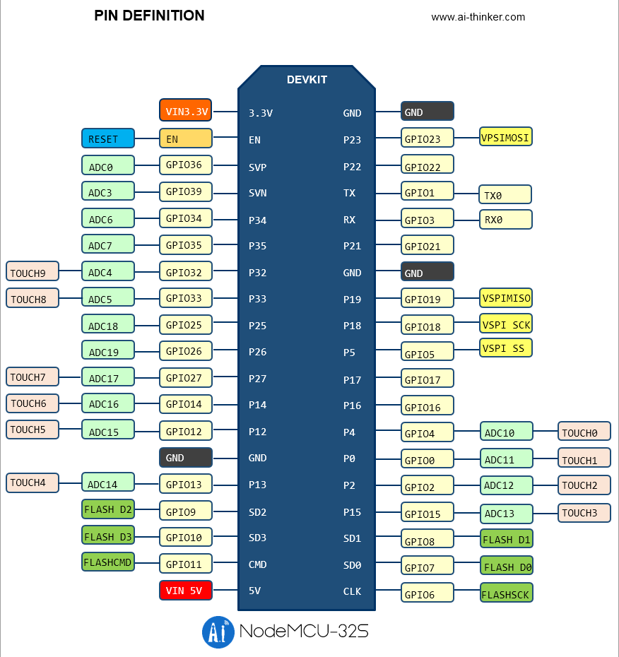
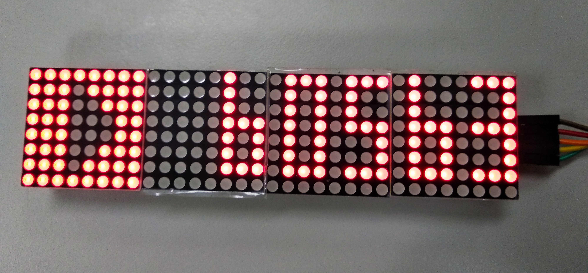

# ESP32-Youtube-Max7219

It a youtube subscribers display with MAX7219 demo for Espressif ESP32 use arduino IDE

## Workspace :
>Chip: Espressif ESP32-WROOM-32  
>Hardware: AI thinker nodemcu-32s  
>Display Hardware: MAX7219(4 in 1)  
>IDE: Arduino IDE v1.8.7  
>Arduion Package Version: arduino-esp32 first stable release  
>ArduinoJson: ArduinoJson 5.13.4  

## Installation :
Install CP210x USB to UART Bridge VCP Drivers [link](https://www.silabs.com/products/development-tools/software/usb-to-uart-bridge-vcp-drivers)   
Makesure you already install arduino IDE.  
Put arduino-esp32 package into  arduino main-folder/hardware  
Open arduino-esp32 -> Tool -> get.exe and wait for complete(in windows)  
Open ESP32_Firebase_demo.ino set port and upload speed 115200

##  Setting :
In ESP32_Youtube_MAX7219.h set wifi parameter  
In ESP32_Youtube_MAX7219.h set google api parameter (use your google api)  
In ESP32_Youtube_MAX7219.h set channel id parameter (the channel id you want to display)  
In ESP32_Youtube_MAX7219.h set pin define

##  Pin Define :
NodeMCU-32s pin define  

|MAX7219    |NodeMCU-32s                    |
|-----------|-------------------------------|
|VCC        |VIN3.3V                        |
|GND	    |GND                            |
|DIN	    |GPIO23 (VPSIMOSI)              |
|CS	        |GPIO Output, e.g. GPIO5        |
|CLK	    |GPIO18 (VSPISCK)               |

Follow the step then you can try to debug now.  
##  Demo :
Flash this firmware and make sure google api and youtube channel id correct   
If all parameters are correct then MAX7219 will display youtube subscribers wiht logo

